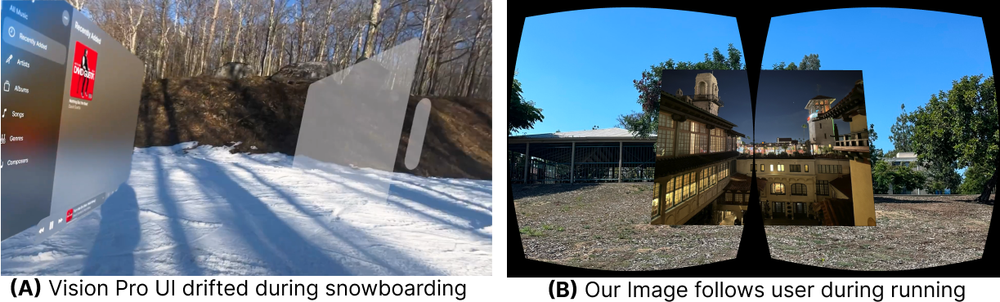

# BOXR

[](LICENSE)
[](LICENSE)

<p align="center">
    <a href="https://izenderi.github.io/"><strong>Ziliang(Johnson) Zhang</strong></a>
    ·
    <a href="https://zexinli.com/"><strong>Zexin Li</strong></a>
    ·
    <a href="https://intra.ece.ucr.edu/~hyoseung/"><strong>Hyoseung Kim</strong></a>
    ·
    <a href="https://intra.ece.ucr.edu/~cong/"><strong>Cong Liu</strong></a>
<h3 align="center"><a href="https://github.com/rtenlab/BOXR">Github</a> | <a href="https://arxiv.org/abs/2410.13084">Paper</a> | <a href="https://2024.rtss.org/accepted-papers/">RTSS'24</a> | <a href="">Talk</a> </h3>
  <div align="center"></div>
</p>

<p align="center">

</p>


<p> Apple Vision Pro UI Drift video: <a href="https://youtu.be/LTVuGsYY2yc">https://youtu.be/LTVuGsYY2yc</a></p>

This Repo is the implementation of the <Strong>BOXR</strong>: Body and head motion Optimization framework for eXtended Reality, which is developed on top of the well-known open-sourced Extended Reality framework <strong>ILLIXR</strong>: Illinois Extended Reality testbed. The major changes can be found below:
* a new scheudler based on the contention-preventive scheduling policy proposed in the paper
* a motion-driven visual inertial odometer (MVIO) included in https://github.com/izenderi/open_vins_illixr.git
* a scene-dependent foveated rendering (SFR) that works with OpenGL.

Please note that BOXR does not develope the entire Framework but rather optimize the motion-to-display (M2D) latency and camera-to-display (C2D) latency in the existing ILLIXR framework. For further question regarding the ILLIXR developement, please direct your questions to [Sarita Adve’s research group][4].

## Citation

Please cite our following paper "BOXR: Body and head motion Optimization framework for eXtended Reality" when you use BOXR for a publication.

```
@inproceedings{zhang2024boxr,
  title={BOXR: Body and head motion Optimization framework for eXtended Reality},
  author={Ziliang Zhang and Zexin Li and Hyoseung Kim and Cong Liu},
  year={2024},
  booktitle={2024 IEEE Real-Time Systems Symposium (RTSS)},
  organization={IEEE}
}
```

## BOXR Get Started
We provide setup documentation for two platforms: PC and Xavier (Embedded System). For PC Setup, we mostly follow the [ILLIXR Get Started page][https://illixr.github.io/ILLIXR/getting_started/] but change some parts.

### Part List
- 3D Print part scheme: NSNF_V01.zip (included in [docs/NSNF_V01.zip](docs/NSNF_v01.zip))
- [Northstar Next][1]
- [ZED Mini Stereo Camera][5]: Only if you plan to [connect BOXR with ZED](#connect-boxr-with-zed)
- PC with a GPU or Xavier depends on which platform you want

### PC Setup
1. Please use the following configurations for OS and Hardware. We will be using native.gl config of ILLIXR
    - a PC with at least one GPU that can support OpenGL. Ideally Nvidia RTX series (RTX30xx, RTX40xx, etc.)
    - Ubuntu 20.04 or 22.04
2. <strong>[Skip if you are using 22.04]</strong> Install the monado plugin for OpenXR
    ```shell
    sudo apt-get -y install wget software-properties-common
    sudo apt-get update
    sudo add-apt-repository ppa:monado-xr/monado -y -u
    sudo wget -nv https://monado.freedesktop.org/keys/monado-ci.asc -O /etc/apt/trusted.gpg.d/monado-ci.asc
    sudo echo 'deb https://monado.pages.freedesktop.org/monado/apt focal main' | tee /etc/apt/sources.list.d/monado-ci.list
    sudo apt update
    ```
3. Install other dependencies
    ```shell
    sudo apt-get install libglew-dev libglu1-mesa-dev libsqlite3-dev libx11-dev libgl-dev pkg-config libopencv-dev libeigen3-dev libc6-dev libspdlog-dev libboost-all-dev libgflags-dev git libglfw3-dev glslang-dev glslang-tools libjpeg-dev libusb-1.0.0-dev libuvc-dev libopencv-dev libopenxr-dev libopenxr1-monado libpng-dev libsdl2-dev libtiff-dev udev libudev-dev libvulkan-dev vulkan-validationlayers libwayland-dev wayland-protocols libx11-xcb-dev libxcb-glx0-dev libxcb-randr0-dev libxkbcommon-dev
    ```
4. Make sure the `$PATH` and `$LD_LIBRARY_PATH` has the correct value
    ```shell
    echo $LD_LIBRARY_PATH # if it is noneor no /usr/local/lib then do the following

    export LD_LIBRARY_PATH=$LD_LIBRARY_PATH:/usr/local/lib
    sudo ldconfig # for sudo usage, LD_LIBRARY_PATH will pass to sudo with this line
    ```
5. <strong>[Use sudo]</strong> If you are building for the first time, build the project with the provided script [init_build.sh](init_build.sh). it has to be built in <strong>sudo</strong> for our implementation to work However, if you are facing some problem like "fatal: remote hungup", please try manually build line-by-line with the following commands:
    ```shell
    # Use Sudo 
    rm -rf build/ && mkdir build && cp data.zip ./build && cd build
    cmake .. -DCMAKE_BUILD_TYPE=Debug -DYAML_FILE=profiles/native_gl.yaml
    cmake --build . -j$(nproc)
    cmake --build . -t docs 
    cmake --install .
    ```
6. if you have the data.zip in the repo root, please extract it there. Or you will have segmentation fault when running.  
7. Run with the following command. Use Sudo as well. Make sure to replace `<path_here>` to the <strong>ABSOLUTE PATH</strong> of the `data=` and `demo_data=`. You can see `illixr.yaml` in repo root after building `<path_here>`
    ```shell
    # use sudo, I removed the debugview and audio but you can refer to illixr.yaml for full plugins
    main.dbg.exe --plugins=offline_imu,offline_cam,gtsam_integrator,pose_prediction,gldemo,timewarp_gl --vis=openvins --data=<path_here> --demo_data=<path_here> --enable_offload=false --enable_alignment=false --enable_verbose_errors=false --enable_pre_sleep=false
    ```
8. When you change the code in this repo (i.e. does not change OpenVINS), you can easily rebuild the BOXR project with [rebuild.sh](rebuild.sh)

### Xavier Setup
1. BOXR has been tested on the following embedded systems: Nvidia Jetson AGX Xavier, Nvidia Jetson Orin Nano. We recommend first try with the Xavier and then move on to Nano.
2. Follow the [Step 1 and 3 of the PC Setup](#pc-setup). However, when you see the below error when `sudo apt-get install` below, this means some pacakges cannot be found in ARM
    ```shell
    # sudo apt-get install ...
    ...
    E: Failed to fetch http://ports.ubuntu.com/ubuntu-ports/pool/main/t/tiff/libtiff-dev_4.1.0+git191117-2ubuntu0.20.04.10_arm64.deb  404  Not Found [IP: 185.125.190.36 80]
    E: Failed to fetch http://ports.ubuntu.com/ubuntu-ports/pool/main/t/tiff/libtiff5_4.1.0+git191117-2ubuntu0.20.04.10_arm64.deb  404  Not Found [IP: 185.125.190.36 80]
    E: Failed to fetch http://ports.ubuntu.com/ubuntu-ports/pool/main/t/tiff/libtiffxx5_4.1.0+git191117-2ubuntu0.20.04.10_arm64.deb  404  Not Found [IP: 185.125.190.36 80]
    ```
3. We will try to fix it using the following 
    - Try to see the specific versions are needed, and search google: libtiff-dev ubuntu 20.04. ***Be Sure to match the package version***
    - Install the dependencies, and then run the `sudo apt-get install` again until you see no missing pacakges
4. There may also be a problem when installing or compileing OpenCV. During the build process, you may encounter the compilation failure like `cannot import opencv2/...` or `opencv/auroc.h not found`. This may due to the lack of `libopencv-contrib4.2` or mis-match version of `libopencv-dev` and `libopencv-contrib`. Be sure to check the version with below lines:
    ```shell
    dpkg -l libopencv-dev
    dpkg -l libopencv-contrib
    ```
    For 20.04 on Xavier or Nano, we need opencv 4.2. If you see missing or mis-match, you can fix the problem with the following lines:
    ```shell
    sudo apt-get install libopencv-dev=4.2.0+dfsg-5
    sudo apt-get install libopencv-contrib4.2
    ```
## Change the evaluation trajectory
By default, the `data.zip` automatically downloaded is from EuRoC MAV Dataset Vicon room 1 “medium”. You can download additional trajectories from [The EuRoC MAV Dataset][9]. Please download the ASL dataset format and unpack it. 

1. Change the `data=` to the absolute path of `mav0` folder. For example, `/home/johnson/eurocmav/MH01/mav0`
2. In the `plugins/ground_truth_slam/plugin.cpp`, make the following changes in `_m_dataset_first_time{ViconRoom1Medium}`
    ```cpp
    ...
    #define ViconRoom1Easy      1403715273262142976
    ...
    #define MachineHall01       1403636580838555648
    ...
    class ground_truth_slam : public plugin {
    public:
        ground_truth_slam(std::string name_, phonebook* pb_)
            ...
            , _m_dataset_first_time{ViconRoom1Medium} // CHANGE ViconRoom1Medium to matching define, i.e. MachineHall01 
            , _m_first_time{true} {
            spdlogger(std::getenv("GROUND_TRUTH_SLAM_LOG_LEVEL"));
        }
    ```

## Evaluate BOXR with different Frame Rate settings
For the ease of reproduction, we included the FPS parameter study that can be used to test the motion-to-display (M2D) and camera-to-display (C2D) latency in the Fig.12. Please see the file [autorun_fps_exp.sh](autorun_fps_exp.sh) and folder [fps_exp](fps_exp) for more details. 

Remeber to replace the `<path_here>` in [autorun_fps_exp.sh](autorun_fps_exp.sh) to the tested trajectory.

## Connect BOXR with ZED
You can plug in a ZED camera to PC or embedded device for real-world deployment. This solution is based on https://github.com/ILLIXR/ILLIXR/issues/414.

1. Download the [ZED SDK][6] and install with this [link][7]. Verify with ZED_Explorer in `/usr/local/zed/tools/`
2. Download the calibration file specific to your ZED camera [here][8]. Normally you don't need to calibrate but if necessary, please use `/usr/local/zed/tools/ZED_Calibration`
3. In `cmake/GetOpenVINS.cmake`, change the following lines:
    ```cmake
    GIT_REPOSITORY https://github.com/izenderi/open_vins_illixr   # Git repo for source code
    # GIT_TAG 1802799bc7a90478567cee3a1d95c00d18e79446         # 030324 HEAD
    GIT_TAG 1843b92c3a6cbc811c1b2eeb9b62f8ad3baec6db           # CHANGE to this SHA
    ```
4. navigate to `plugins/plugins.yaml`, add a new profile with name "zed_enabled" using the below code. And then in `profiles/`, create a new file called `zed_enabled.yaml`:
    ```yaml
    plugins: zed,gtsam_integrator,pose_prediction,gldemo,timewarp_gl,debugview,offload_data,audio_pipeline
    visualizers: openvins
    enable_offload: false
    enable_alignment: false
    enable_verbose_errors: false
    enable_pre_sleep: false
    ```
5. build with the following commands:
    ```shell
    # Use Sudo 
    rm -rf build/ && mkdir build && cp data.zip ./build && cd build
    cmake .. -DCMAKE_BUILD_TYPE=Debug -DYAML_FILE=profiles/zed_enabled.yaml
    cmake --build . -j$(nproc)
    cmake --build . -t docs 
    cmake --install .
    ```

## Acknowledgements

We would like to extend our sincere gratitute to [Sarita Adve’s research group][4] for their [ILLIXR project][3]. Please also consider citing them for the original ILLIXR implementation.

BOXR's software part is developed based on the ILLIXR framework, and hardware part is based on the open-sourced [Northstar Next][1] Headmount Display.

## Licensing Structure

BOXR is available as open-source software under the [MIT License](LICENSE).
**The MIT license is limited to only this software**.
The external libraries and softwares included in BOXR each have their own licenses and must be used according to those licenses:

- [ILLIXR][3] \ [University of Illinois/NCSA Open Source License][2]

Please refer to [ILLIXR][3] for the nested license for the used component


## Get in Touch

We really appreciate your comments and pull requests. If you have any questions, please contact Ziliang(Johnson) <ziliang.zhang@email.ucr.edu>. We would be happy to discuss any potential collaboration on XR research.


[//]: # (- References -)

[1]:    https://docs.projectnorthstar.org/project-north-star/northstar-next
[2]:    https://github.com/ILLIXR/ILLIXR/blob/master/LICENSE
[3]:    https://github.com/ILLIXR
[4]:    http://rsim.cs.illinois.edu
[5]:    https://www.stereolabs.com/store/products/zed-mini
[6]:    https://www.stereolabs.com/developers/release
[7]:    https://www.stereolabs.com/docs/installation/linux/
[8]:    https://www.stereolabs.com/developers/calib
[9]:    https://projects.asl.ethz.ch/datasets/doku.php?id=kmavvisualinertialdatasets
